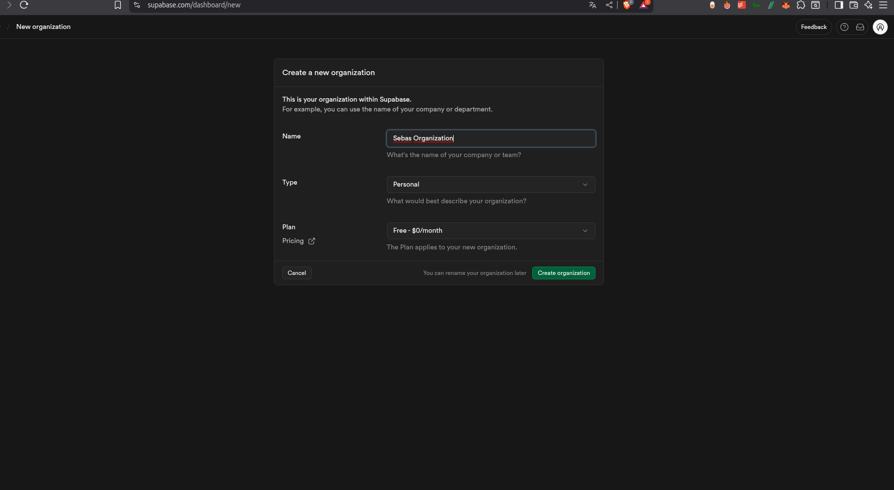
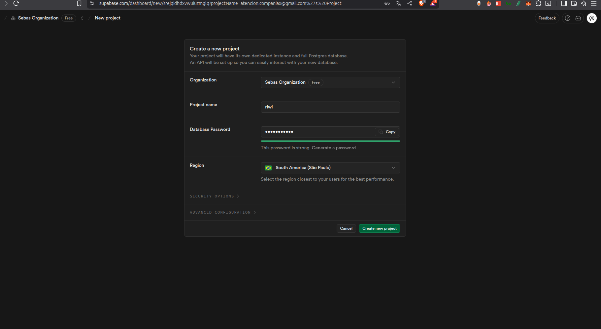
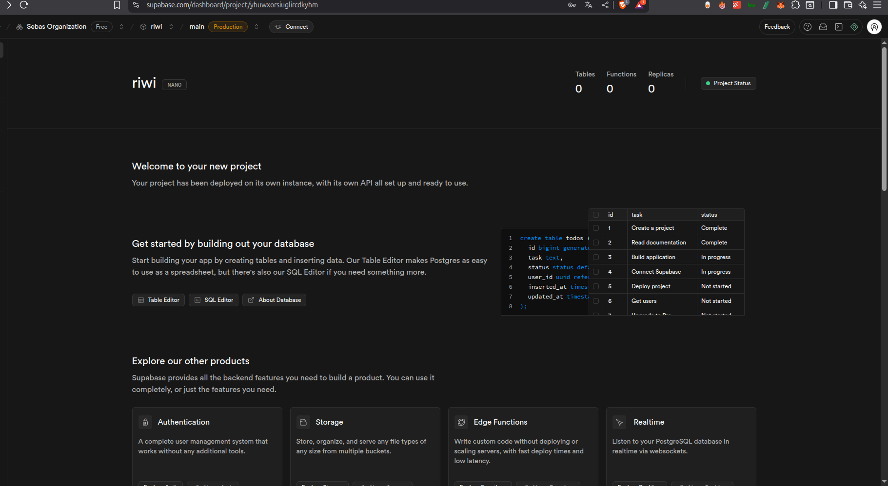
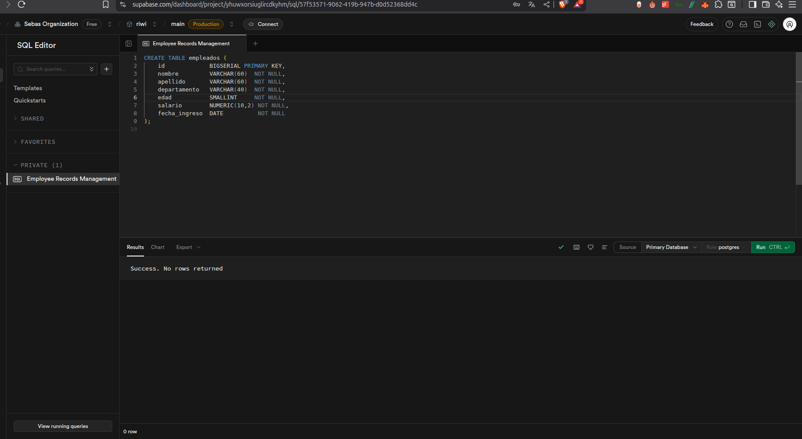
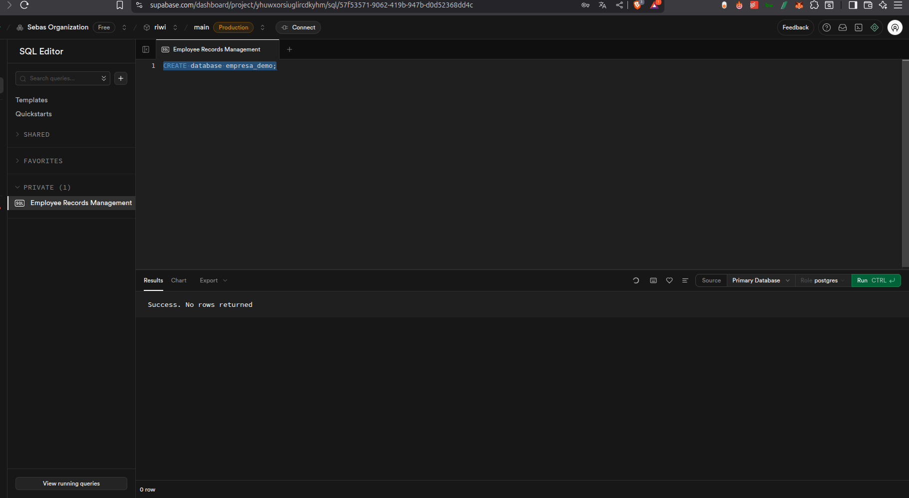
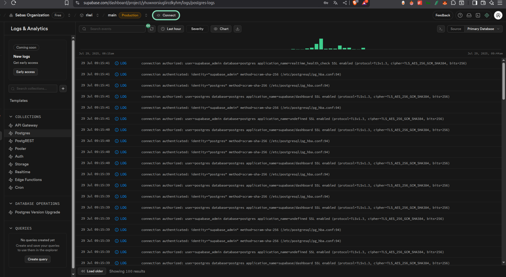
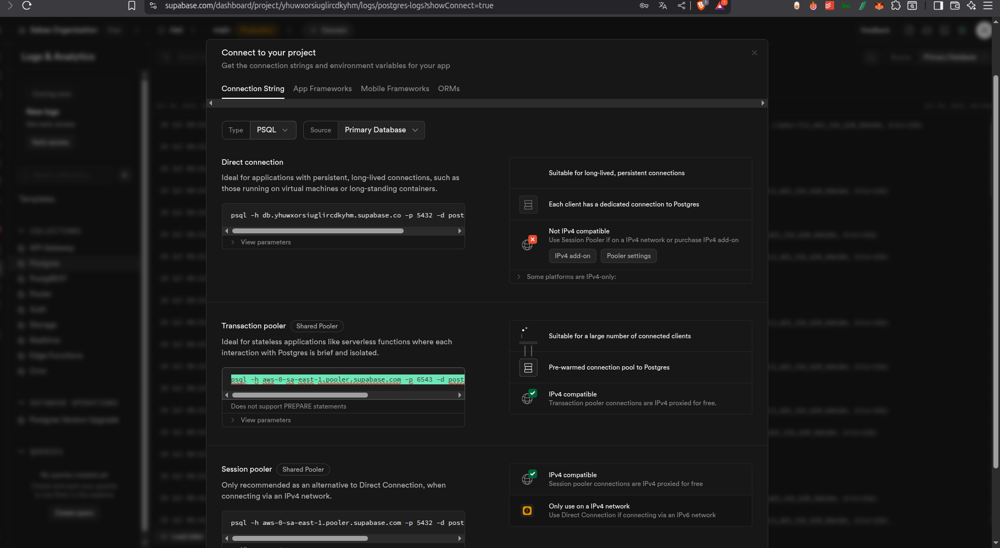

# Guía paso a paso: Supabase desde cero

Esta guía te mostrará **todo el recorrido** para comenzar con Supabase después de registrarte, desde la creación de tu organización hasta la gestión y consulta de datos. Está basada en las capturas adjuntas y extendida con buenas prácticas y recursos adicionales.

> **Objetivo**: Que cualquier persona que clone este repositorio pueda replicar todos los pasos y comprenda los conceptos fundamentales de Supabase.

---

## Índice
1. [Prerrequisitos](#prerrequisitos)
2. [Registro y creación de organización](#registro-y-creación-de-organización)
3. [Creación de proyecto](#creación-de-proyecto)
4. [Visión general de la interfaz](#visión-general-de-la-interfaz)
5. [Creación de la base de datos y tablas](#creación-de-la-base-de-datos-y-tablas)
6. [Inserción de datos](#inserción-de-datos)
7. [Uso del editor SQL](#uso-del-editor-sql)
8. [Acceso a datos vía API](#acceso-a-datos-vía-api)
9. [Políticas de seguridad (RLS)](#políticas-de-seguridad-rls)
10. [Recursos adicionales](#recursos-adicionales)

---

## Prerrequisitos
- Navegador web actualizado
- Cuenta en [Supabase](https://supabase.com)
- Conceptos básicos de SQL y REST (opcional, pero recomendado)

---

## Registro y creación de organización
1. Dirígete a `supabase.com` y selecciona **Start your project**.
2. Regístrate con GitHub, Google o correo electrónico.
3. Al ingresar por primera vez se te pedirá crear una **Organization**.
   - **Name**: elige un nombre representativo (p. ej. `Sebas Organization`).
   - **Type**: selecciona *Personal* o *Company*.
   - **Plan**: elige el plan *Free* para comenzar.
4. Haz clic en **Create organization**.



> **Tip:** Puedes cambiar el nombre de la organización más adelante desde **Settings → General**.

---

## Creación de proyecto
1. Dentro de tu organización, pulsa **New project**.
2. Completa los campos:
   - **Project name**
   - **Database password** (guárdala en un lugar seguro)
   - **Region** (elige la más cercana a tus usuarios)
3. Espera a que el proyecto termine de aprovisionarse (~2 min).



---

## Visión general de la interfaz
La consola de Supabase se divide en:
- **Table Editor**: CRUD visual.-
- **SQL Editor**: ejecución de scripts.
- **Authentication, Storage, Edge Functions** y más módulos.



---

## Creación de la base de datos y tablas
### Opción 1: Table Editor (GUI)
1. Abre **Table Editor → New table**.
2. Define **nombre** de la tabla, p. ej. `empleados`.
3. Agrega las columnas:

| Columna       | Tipo           | Nulos | Descripción             |
|---------------|---------------|-------|-------------------------|
| `id`          | `uuid` PK      | No    | Identificador único     |
| `nombre`      | `varchar(60)`  | No    | Primer nombre           |
| `apellido`    | `varchar(60)`  | No    | Apellido                |
| `departamento`| `varchar(40)`  | No    | Área de la empresa      |
| `edad`        | `smallint`     | No    | Edad                    |
| `salario`     | `numeric(10,2)`| No    | Salario mensual         |
| `fecha_ingreso`| `date`        | No    | Fecha de contratación   |

4. Guarda los cambios.



### Opción 2: SQL Editor
```sql
-- Crear tabla empleados
CREATE TABLE public.empleados (
  id uuid DEFAULT gen_random_uuid() PRIMARY KEY,
  nombre VARCHAR(60)  NOT NULL,
  apellido VARCHAR(60) NOT NULL,
  departamento VARCHAR(40) NOT NULL,
  edad SMALLINT NOT NULL,
  salario NUMERIC(10,2) NOT NULL,
  fecha_ingreso DATE NOT NULL
);
```
Ejecuta el script en **SQL Editor → Run**.



---

## Inserción de datos
```sql
INSERT INTO public.empleados (nombre, apellido, departamento, edad, salario, fecha_ingreso)
VALUES ('Ana', 'Rojas', 'TI', 32, 3600.00, '2020-02-10');
```
Confirma la inserción en el **Table Editor**.


---

## Uso del editor SQL
El **SQL Editor** permite:
- Ejecutar consultas `SELECT`.
- Crear `VIEWS`, `FUNCTIONS`, *stored procedures*.
- Administrar migraciones con historial de scripts.

Ejemplo de consulta:
```sql
SELECT nombre, salario
FROM public.empleados
WHERE salario > 3000;
```

---

## Acceso a datos
Cada proyecto expone endpoints REST y claves API.
1. Ve a **Settings → API**.
2. Copia tu `anon` o `service_role` key.
3. Ejemplo en `curl`:
```bash
curl -H "apikey: <YOUR_ANON_KEY>" \
     -H "Authorization: Bearer <YOUR_ANON_KEY>" \
     "https://<PROJECT_REF>.supabase.co/rest/v1/empleados?select=*"
```

También puedes instalar el cliente
```bash
npm install @supabase/supabase-js
```
y consumirlo:
```js
import { createClient } from '@supabase/supabase-js';
const supabase = createClient('https://<PROJECT_REF>.supabase.co', '<YOUR_ANON_KEY>');
const { data, error } = await supabase.from('empleados').select('*');
```

### Conexión desde la terminal (`psql`) y clientes GUI

Además de la API y el SDK, puedes conectarte directamente a la base de datos **PostgreSQL** que provee Supabase. Esto resulta útil para ejecutar consultas avanzadas, inspeccionar el esquema o usar herramientas gráficas familiares.

#### 1. Usar `psql` en la terminal
1. Abre la consola de Supabase y navega a **Settings → Database → Connection string**.
2. Copia la cadena **Direct connection** que luce similar a:
   ```bash
   psql "postgresql://postgres:<YOUR_PASSWORD>@db.<project_ref>.supabase.co:5432/postgres"
   ```
3. Pega y ejecuta en tu terminal (debes tener `psql` instalado). Acepta la conexión SSL si se solicita.
4. Ahora puedes lanzar comandos SQL directamente:
   ```sql
   \dt        -- listar tablas
   SELECT COUNT(*) FROM empleados;
   \q         -- salir
   ```



#### 2. Conectar con DBeaver (o cualquier cliente GUI)
> En la ventana **Connection string** de Supabase (imagen 9) verás un cuadro con los valores listos para copiar. Usa exactamente esos datos para rellenar los campos de tu cliente GUI.
1. Crea una nueva conexión **PostgreSQL**.
2. Completa los campos:
   - **Host**: `db.<project_ref>.supabase.co`
   - **Port**: `5432`
   - **Database**: `postgres` (o el que uses)
   - **Username**: `postgres`
   - **Password**: la que definiste al crear el proyecto
3. En **SSL** marca *Require* y selecciona `Prefer` (Supabase solo acepta conexiones SSL).
4. Prueba la conexión y guarda.

Ejemplo tomando la cadena del *transaction pooler*:
```bash
psql -h aws-0-sa-east-1.pooler.supabase.com -p 6543 -d postgres -U postgres.<project_ref>
```
Se traduce en DBeaver a:
* Host: `aws-0-sa-east-1.pooler.supabase.com`
* Port: `6543`
* Database: `postgres`
* Username: `postgres.<project_ref>`
* Password: <tu_password>
* SSL mode: `Require` (o `Verify-full` si tienes CA)




Una vez conectado podrás explorar tablas, ejecutar queries y exportar datos con toda la comodidad de una interfaz gráfica.
 


---

## Políticas de seguridad (RLS)
- Por defecto, las tablas nuevas tienen **RLS deshabilitado**.
- Activa RLS desde **Table → RLS toggle** y crea políticas para controlar acceso.
```sql
-- Permitir lectura a todos los usuarios autenticados
create policy "Usuarios pueden leer empleados"
  on public.empleados
  for select
  using ( auth.role() = 'authenticated' );
```

---

## Recursos adicionales
- Documentación oficial: <https://supabase.com/docs>
- Quickstarts y ejemplos: <https://github.com/supabase/supabase/tree/master/examples>
- Canal de YouTube Supabase España: <https://www.youtube.com/@supabase-es>

---


## Administración de roles y permisos

A continuación se muestra un resumen práctico para **crear un nuevo usuario en Postgres (Supabase)**, asignarle distintos niveles de permisos y comprobarlos.

```sql
-- 1. Crear un rol con contraseña
CREATE ROLE nuevo_usuario LOGIN PASSWORD 'Tu_Contraseña_Fuerte';

-- 2. Permisos globales mínimos
GRANT CONNECT ON DATABASE postgres      TO nuevo_usuario;
GRANT CONNECT ON DATABASE supabase_dev TO nuevo_usuario;

-- 3. Permisos sobre el esquema y tablas
GRANT USAGE ON SCHEMA public TO nuevo_usuario;

-- Sólo lectura
GRANT SELECT ON ALL TABLES IN SCHEMA public TO nuevo_usuario;
ALTER DEFAULT PRIVILEGES IN SCHEMA public
  GRANT SELECT ON TABLES TO nuevo_usuario;

-- Escritura (opcional)
GRANT INSERT, UPDATE, DELETE ON ALL TABLES IN SCHEMA public TO nuevo_usuario;
ALTER DEFAULT PRIVILEGES IN SCHEMA public
  GRANT INSERT, UPDATE, DELETE ON TABLES TO nuevo_usuario;

-- Secuencias
GRANT USAGE, SELECT ON ALL SEQUENCES IN SCHEMA public TO nuevo_usuario;
ALTER DEFAULT PRIVILEGES IN SCHEMA public
  GRANT USAGE, SELECT ON SEQUENCES TO nuevo_usuario;
```

### Privilegios avanzados

| Bandera        | Descripción                                          |
|----------------|-------------------------------------------------------|
| `CREATEDB`     | Puede crear nuevas bases de datos                     |
| `CREATEROLE`   | Puede crear o modificar otros roles                   |
| `BYPASSRLS`    | Omite las políticas de RLS (rol "interno")           |
| `REPLICATION`  | Permite crear slots de replicación                    |
| `SUPERUSER`    | *No disponible* en Supabase                           |

Ejemplos:
```sql
-- Habilitar privilegios elevados
ALTER ROLE nuevo_usuario CREATEDB CREATEROLE BYPASSRLS;

-- Consultar privilegios actuales
SELECT rolname, rolsuper, rolcreaterole, rolcreatedb,
       rolbypassrls, rolreplication
FROM pg_roles
WHERE rolname = 'nuevo_usuario';
```

Para revocar o eliminar:
```sql
REVOKE INSERT, UPDATE, DELETE ON ALL TABLES IN SCHEMA public FROM nuevo_usuario;
ALTER ROLE nuevo_usuario NOCREATEROLE NOCREATEDB NOBYPASSRLS;
DROP ROLE IF EXISTS nuevo_usuario;
```

Con estos comandos podrás crear usuarios **solo lectura**, **lectura-escritura** o **casi-admin** según tus necesidades.

---

### Licencia
[MIT](LICENSE)
